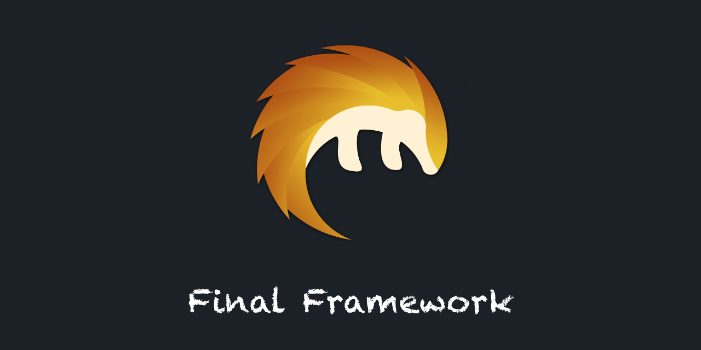

# final-framework

## 概述

`final-framework`致力于提供简单、灵活且功能强大的`java`开发脚手架。

## 特性

### 资源导入

默认导入以下路径的资源：

* classpath:spring-config-*.xml
* classpath*:config/spring-config-*.xml
* classpath*:spring/spring-config-*.xml

可以使用`spring.application.import-resource.use-default`来取消默认资源的导入；
可以使用`spring.application.import-resource.locations`来指定自定义的导入资源。

## 致谢

* 感谢<a href="https://www.jetbrains.com/">jetbrains</a>提供的免费授权。
