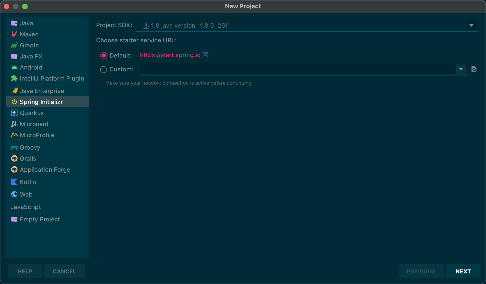
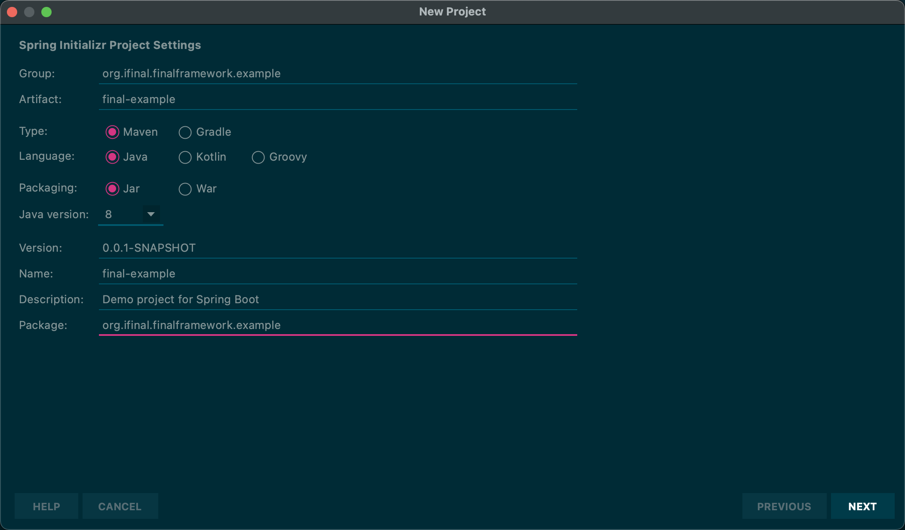

# 创建工程

## 简介

本节介绍如何创建一个`final`工程。

通过本节学习，您将得到以下收获：

* 创建一个`final`工程。

## 创建 Final 工程

### 创建一个 Spring Boot 工程

* 使用 Idea Spring Initializr

1. 创建一个工程

   

2. 配置新工程信息

   

* 使用 Spring Initializr

Use [`start.spring.io`](https://start.spring.io) to create a spring project.


### 导入依赖

#### Maven

添加 `final-boot` 依赖通过**替换 `parent`节点**或**导入`pom`**。

* 替换 Parent 节点

```xml
<!-- https://mvnrepository.com/artifact/org.ifinal.finalframework.starter/final-starter -->
<parent>
    <groupId>org.ifinal.finalframework.starter</groupId>
    <artifactId>final-starter</artifactId>
    <version>{{ site.final.version }}</version>
    <relativePath/> <!-- lookup parent from repository -->
</parent>
```

* 导入 Pom

```xml
<!-- https://mvnrepository.com/artifact/org.ifinal.finalframework.starter/final-starter -->
<dependencyManagement>
    <dependencies>
        <dependency>
            <groupId>org.ifinal.finalframework.starter</groupId>
            <artifactId>final-starter</artifactId>
            <version>{{ site.final.version }}</version>
            <scope>import</scope>
            <type>pom</type>
        </dependency>
    </dependencies>
</dependencyManagement>
```