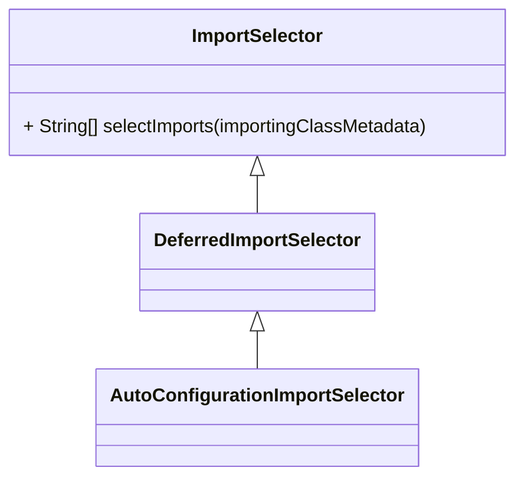

# EnableAutoConfiguration

<iframe id="embed_dom" name="embed_dom" frameborder="0" style="display:block;width:100%; height:500px;" src="https://www.processon.
com/embed/603c79915653bb36bbe62596"></iframe>

## What

```java
package org.springframework.boot.autoconfigure;

@Target(ElementType.TYPE)
@Retention(RetentionPolicy.RUNTIME)
@Documented
@Inherited
@AutoConfigurationPackage
@Import(AutoConfigurationImportSelector.class)
public @interface EnableAutoConfiguration {

	String ENABLED_OVERRIDE_PROPERTY = "spring.boot.enableautoconfiguration";

	/**
	 * Exclude specific auto-configuration classes such that they will never be applied.
	 * @return the classes to exclude
	 */
	Class<?>[] exclude() default {};

	/**
	 * Exclude specific auto-configuration class names such that they will never be
	 * applied.
	 * @return the class names to exclude
	 * @since 1.3.1
	 */
	String[] excludeName() default {};

}
```



