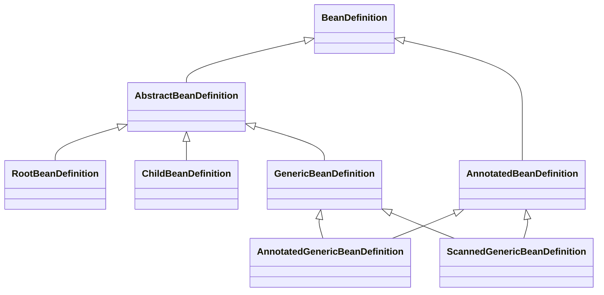

# bean-definition

```mermaid
classDiagram
    BeanDefinition <|-- AbstractBeanDefinition
    BeanDefinition <|-- AnnotatedBeanDefinition
    AbstractBeanDefinition <|-- RootBeanDefinition
    AbstractBeanDefinition <|-- ChildBeanDefinition
    AbstractBeanDefinition <|-- GenericBeanDefinition
    GenericBeanDefinition <|-- AnnotatedGenericBeanDefinition
    AnnotatedBeanDefinition <|-- AnnotatedGenericBeanDefinition
    AnnotatedBeanDefinition <|-- ScannedGenericBeanDefinition
    GenericBeanDefinition <|-- ScannedGenericBeanDefinition

```

