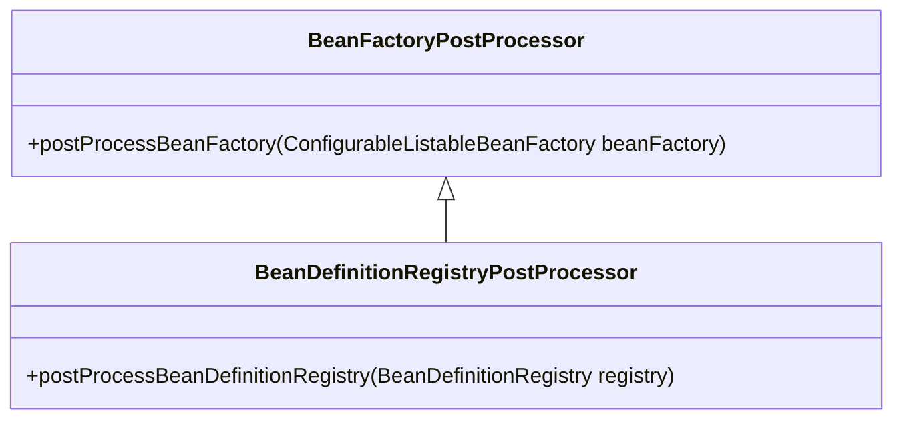

# Bean 工厂后置处理器

## What

**`BeanFactoryPostProcessor`是Spring提供的对`BeanFactory`的后置处理器扩展点。**

Spring提供了`BeanFactoryPostProcessor`接口及基扩展接口`BeanDefinitionRegistryPostProcessor`，以便开发者能够分别对`ConfigurableListableBeanFactory`
和`BeanDefinitionRegistry`进行扩展处理。其类关系如图所示：

**特性：**

* **自动检测**：`ApplicationContext`自动检测Bean定义中的`BeanFactoryPostProcessor`，并在Bean实例化之前应用,也可以通过`ConfigurableApplicationContext`进行注册。
* **排序**：通过`ConfigurableApplicationContext`编程方式注册的`BeanFactoryPostProcessor`将按注册顺序进行调用，其它将按`PriorityOrdered`、`Ordered`的顺序进行调用，且不支持`@Order
  `注解。
  
## When

## Build-In

| Class                                  | Feature                                                      |
| -------------------------------------- | ------------------------------------------------------------ |
| `ConfigurationClassPostProcessor`      | 用于解析配置类，如`@Configuration`、`@ComponentScan`等注解标记的类。 |
| `AutowiredAnnotationBeanPostProcessor` |                                                              |
| `CommonAnnotationBeanPostProcessor`    |                                                              |
| `EventListenerMethodProcessor`         |                                                              |
|                                        |                                                              |
|                                        |                                                              |
|                                        |                                                              |
|                                        |                                                              |
|                                        |                                                              |

