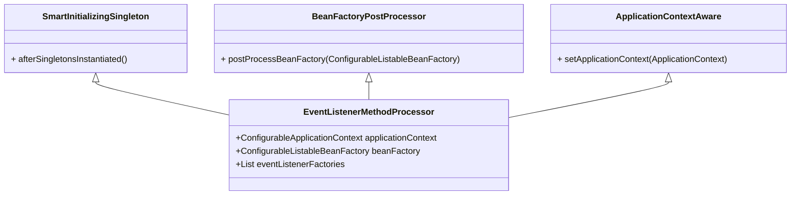

# @EventListener

## 简介

**`@EventListener`，一个可以把`Method`标记为处理应用事件`ApplicationEvent`处理器`ApplicationListener`的注解。**

## 用法

### 声明

声明一个`public`的方法并指定要处理的`ApplicationEvent`，如`ApplicationReadyEvent`，同时使用`@EventListener`标记:

```java
package org.ifinalframework.example;

@Slf4j
@SpringBootApplication
public class FinalApplication {

   public static void main(final String[] args) {

      SpringApplication application = new SpringApplication(FinalApplication.class);
      application.run(args);

   }

   @EventListener
   public void onReady(final ApplicationReadyEvent readyEvent) {
      logger.info("onReady from @EventListener");
   }

}
```

### 尝试

```shell
--2021-01-15 15:19:21.157 - INFO 6522 --- [           main] o.i.f.example.FinalApplication           : [                                      ] : onReady from @EventListener
```

## 原理

### 注册

在容器的启动过程中，会注册以下两个Bean：

* EventListenerMethodProcessor
* DefaultEventListenerFactory

以下为注册的关键代码块`AnnotationConfigUtils.registerAnnotationConfigProcessors()`：

```java
package org.springframework.context.annotation;

public abstract class AnnotationConfigUtils {

   /**
    * The bean name of the internally managed @EventListener annotation processor.
    */
   public static final String EVENT_LISTENER_PROCESSOR_BEAN_NAME =
           "org.springframework.context.event.internalEventListenerProcessor";

   /**
    * The bean name of the internally managed EventListenerFactory.
    */
   public static final String EVENT_LISTENER_FACTORY_BEAN_NAME =
           "org.springframework.context.event.internalEventListenerFactory";

   public static Set<BeanDefinitionHolder> registerAnnotationConfigProcessors(
           BeanDefinitionRegistry registry, @Nullable Object source) {

      if (!registry.containsBeanDefinition(EVENT_LISTENER_PROCESSOR_BEAN_NAME)) {
         RootBeanDefinition def = new RootBeanDefinition(EventListenerMethodProcessor.class);
         def.setSource(source);
         beanDefs.add(registerPostProcessor(registry, def, EVENT_LISTENER_PROCESSOR_BEAN_NAME));
      }

      if (!registry.containsBeanDefinition(EVENT_LISTENER_FACTORY_BEAN_NAME)) {
         RootBeanDefinition def = new RootBeanDefinition(DefaultEventListenerFactory.class);
         def.setSource(source);
         beanDefs.add(registerPostProcessor(registry, def, EVENT_LISTENER_FACTORY_BEAN_NAME));
      }
   }

}
```

### DefaultEventListenerFactory

`DefaultEventListenerFactory`是`EventListenerFactory`的默认实现，`EventListenerFactory`接口定义了将`@EventListener`
转化为`ApplicationListener`的策略方法。

* EventListenerFactory

```java
package org.springframework.context.event;

public interface EventListenerFactory {

   boolean supportsMethod(Method method);

   ApplicationListener<?> createApplicationListener(String beanName, Class<?> type, Method method);

}
```

`DefaultEventListenerFactory`将所有标记有`@EventListener`注解的方法转化为`ApplicationListenerMethodAdapter`。

* DefaultEventListenerFactory

```java
package org.springframework.context.event;

public class DefaultEventListenerFactory implements EventListenerFactory, Ordered {

   @Override
   public boolean supportsMethod(Method method) {
      return true;
   }

   @Override
   public ApplicationListener<?> createApplicationListener(String beanName, Class<?> type, Method method) {
      return new ApplicationListenerMethodAdapter(beanName, type, method);
   }

}
```

### EventListenerMethodProcessor

`EventListenerMethodProcessor`是`BeanFactoryPostProcessor`的实现之一，基类关系如下图所示：



#### `postProcessBeanFactory()`

在`postProcessBeanFactory`回调中，获取到容器中所有`EventListenerFactory`实例，这里实际上是`DefaultEventListenerFactory`:

```java
package org.springframework.context.event;

public class EventListenerMethodProcessor
        implements SmartInitializingSingleton, ApplicationContextAware, BeanFactoryPostProcessor {

   @Override
   public void postProcessBeanFactory(ConfigurableListableBeanFactory beanFactory) {
      this.beanFactory = beanFactory;

      Map<String, EventListenerFactory> beans = beanFactory.getBeansOfType(EventListenerFactory.class, false, false);
      List<EventListenerFactory> factories = new ArrayList<>(beans.values());
      AnnotationAwareOrderComparator.sort(factories);
      this.eventListenerFactories = factories;
   }

}
```

#### `afterSingletonsInstantiated()`

在`afterSingletonsInstantiated()`回调中，主要通过以下几个步骤，将一个标记有`@EventListener`的方法转化为`ApplicationListener`
并注册到`ConfigurableApplicationContext`中。

* 遍历容器中所有的bean：

```java
String[]beanNames=beanFactory.getBeanNamesForType(Object.class);
```

* 找出标记有`@EventListener`注解的方法：

```java
annotatedMethods=MethodIntrospector.selectMethods(targetType,(MethodIntrospector.MetadataLookup<EventListener>)
        method->AnnotatedElementUtils.findMergedAnnotation(method,EventListener.class));
```

* 将找到的`method`通过`EventListenerFactory`转化为`ApplicationListener`：

```java
ApplicationListener<?> applicationListener=factory.createApplicationListener(beanName,targetType,methodToUse);
```

* 注册`ApplicationListener`：

```java
context.addApplicationListener(applicationListener);
```

至此，`@EventListener`注解的解析过程就结束了。

## 小结

本文通过分析`EventListenerMethodProcessor`和`DefaultEventListenerFactory`的核心源码，了解了被`@EventListener`
注解标记的方法是如何被解析成`ApplicationListener
`并注册到`ConfigurableApplicationContext`，以实现处理`ApplicationEvent`的原理：

1. 在`BeanFactoryPostProcessor`后置处理器的`postProcessBeanFactory()`回调方法中，获取到所有`EventListenerFactory`实例
2. 在`SmartInitializingSingleton`的`afterSingletonsInstantiated()
   `回调方法中，遍历所有bean，找出标记有`@EventListener`方法通过`EventListenerFactory`转化为`ApplicationListener`
   ，然后添加到`ConfigurableApplicationContext`中。
