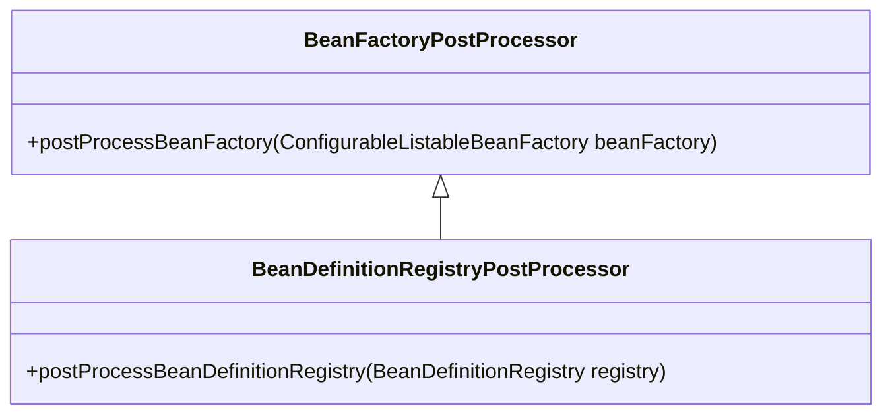

# Bean 工厂后置处理器

## What

**`BeanFactoryPostProcessor`是Spring提供的对`BeanFactory`的后置处理器扩展点。**

Spring提供了`BeanFactoryPostProcessor`接口及基扩展接口`BeanDefinitionRegistryPostProcessor`，以便开发者能够分别对`ConfigurableListableBeanFactory`
和`BeanDefinitionRegistry`进行扩展处理。其类关系如图所示：



## Features

### Registration

`BeanFactoryPostProcessor`可以由`ApplicationContext`容器**自动检测**并在`Bean`实例化之前应用；也可以通过编程接口`ConfigurableApplicationContext.addBeanFactoryPostProcessor(BeanFactoryPostProcessor postProcessor)`进行注册。

### Ordering

`BeanFactoryPostProcessor`按照以下顺序进行调用：

1. 通过`ConfigurableApplicationContext`编程方式注册的`BeanFactoryPostProcessor`;
2. 实现了`PriorityOrdered`接口的`BeanFactoryPostProcessor`；
3. 实现了`Ordered`接口的`BeanFactoryPostProcessor`；
4. 其它`BeanFactoryPostProcessor`。

> `BeanFactoryPostProcessor`不支持`@Order`注解。

## When

`BeanFactoryPostProcessor`在`ConfigurableApplicationContext`的`refresh()`中通过`invokeBeanFactoryPostProcessors(beanFactory)`进行调用：

```java
package org.springframework.context.support;

public abstract class AbstractApplicationContext extends DefaultResourceLoader
        implements ConfigurableApplicationContext {    

    protected void invokeBeanFactoryPostProcessors(ConfigurableListableBeanFactory beanFactory) {
        PostProcessorRegistrationDelegate.invokeBeanFactoryPostProcessors(beanFactory, getBeanFactoryPostProcessors());

        // Detect a LoadTimeWeaver and prepare for weaving, if found in the meantime
        // (e.g. through an @Bean method registered by ConfigurationClassPostProcessor)
        if (beanFactory.getTempClassLoader() == null && beanFactory.containsBean(LOAD_TIME_WEAVER_BEAN_NAME)) {
            beanFactory.addBeanPostProcessor(new LoadTimeWeaverAwareProcessor(beanFactory));
            beanFactory.setTempClassLoader(new ContextTypeMatchClassLoader(beanFactory.getBeanClassLoader()));
        }
    }
}
```

在该方法中，通过`PostProcessorRegistrationDelegate.invokeBeanFactoryPostProcessors`调用容器中所有的`getBeanFactoryPostProcessors()`。

## How


```java
package org.springframework.context.support;

final class PostProcessorRegistrationDelegate {

    private PostProcessorRegistrationDelegate() {
    }


    public static void invokeBeanFactoryPostProcessors(
            ConfigurableListableBeanFactory beanFactory, List<BeanFactoryPostProcessor> beanFactoryPostProcessors) {

        // Invoke BeanDefinitionRegistryPostProcessors first, if any.
        Set<String> processedBeans = new HashSet<>();

        if (beanFactory instanceof BeanDefinitionRegistry) {
            BeanDefinitionRegistry registry = (BeanDefinitionRegistry) beanFactory;
            List<BeanFactoryPostProcessor> regularPostProcessors = new ArrayList<>();
            List<BeanDefinitionRegistryPostProcessor> registryProcessors = new ArrayList<>();

            for (BeanFactoryPostProcessor postProcessor : beanFactoryPostProcessors) {
                if (postProcessor instanceof BeanDefinitionRegistryPostProcessor) {
                    BeanDefinitionRegistryPostProcessor registryProcessor =
                            (BeanDefinitionRegistryPostProcessor) postProcessor;
                    registryProcessor.postProcessBeanDefinitionRegistry(registry);
                    registryProcessors.add(registryProcessor);
                }
                else {
                    regularPostProcessors.add(postProcessor);
                }
            }

            // Do not initialize FactoryBeans here: We need to leave all regular beans
            // uninitialized to let the bean factory post-processors apply to them!
            // Separate between BeanDefinitionRegistryPostProcessors that implement
            // PriorityOrdered, Ordered, and the rest.
            List<BeanDefinitionRegistryPostProcessor> currentRegistryProcessors = new ArrayList<>();

            // First, invoke the BeanDefinitionRegistryPostProcessors that implement PriorityOrdered.
            String[] postProcessorNames =
                    beanFactory.getBeanNamesForType(BeanDefinitionRegistryPostProcessor.class, true, false);
            for (String ppName : postProcessorNames) {
                if (beanFactory.isTypeMatch(ppName, PriorityOrdered.class)) {
                    currentRegistryProcessors.add(beanFactory.getBean(ppName, BeanDefinitionRegistryPostProcessor.class));
                    processedBeans.add(ppName);
                }
            }
            sortPostProcessors(currentRegistryProcessors, beanFactory);
            registryProcessors.addAll(currentRegistryProcessors);
            invokeBeanDefinitionRegistryPostProcessors(currentRegistryProcessors, registry);
            currentRegistryProcessors.clear();

            // Next, invoke the BeanDefinitionRegistryPostProcessors that implement Ordered.
            postProcessorNames = beanFactory.getBeanNamesForType(BeanDefinitionRegistryPostProcessor.class, true, false);
            for (String ppName : postProcessorNames) {
                if (!processedBeans.contains(ppName) && beanFactory.isTypeMatch(ppName, Ordered.class)) {
                    currentRegistryProcessors.add(beanFactory.getBean(ppName, BeanDefinitionRegistryPostProcessor.class));
                    processedBeans.add(ppName);
                }
            }
            sortPostProcessors(currentRegistryProcessors, beanFactory);
            registryProcessors.addAll(currentRegistryProcessors);
            invokeBeanDefinitionRegistryPostProcessors(currentRegistryProcessors, registry);
            currentRegistryProcessors.clear();

            // Finally, invoke all other BeanDefinitionRegistryPostProcessors until no further ones appear.
            boolean reiterate = true;
            while (reiterate) {
                reiterate = false;
                postProcessorNames = beanFactory.getBeanNamesForType(BeanDefinitionRegistryPostProcessor.class, true, false);
                for (String ppName : postProcessorNames) {
                    if (!processedBeans.contains(ppName)) {
                        currentRegistryProcessors.add(beanFactory.getBean(ppName, BeanDefinitionRegistryPostProcessor.class));
                        processedBeans.add(ppName);
                        reiterate = true;
                    }
                }
                sortPostProcessors(currentRegistryProcessors, beanFactory);
                registryProcessors.addAll(currentRegistryProcessors);
                invokeBeanDefinitionRegistryPostProcessors(currentRegistryProcessors, registry);
                currentRegistryProcessors.clear();
            }

            // Now, invoke the postProcessBeanFactory callback of all processors handled so far.
            invokeBeanFactoryPostProcessors(registryProcessors, beanFactory);
            invokeBeanFactoryPostProcessors(regularPostProcessors, beanFactory);
        }

        else {
            // Invoke factory processors registered with the context instance.
            invokeBeanFactoryPostProcessors(beanFactoryPostProcessors, beanFactory);
        }

        // Do not initialize FactoryBeans here: We need to leave all regular beans
        // uninitialized to let the bean factory post-processors apply to them!
        String[] postProcessorNames =
                beanFactory.getBeanNamesForType(BeanFactoryPostProcessor.class, true, false);

        // Separate between BeanFactoryPostProcessors that implement PriorityOrdered,
        // Ordered, and the rest.
        List<BeanFactoryPostProcessor> priorityOrderedPostProcessors = new ArrayList<>();
        List<String> orderedPostProcessorNames = new ArrayList<>();
        List<String> nonOrderedPostProcessorNames = new ArrayList<>();
        for (String ppName : postProcessorNames) {
            if (processedBeans.contains(ppName)) {
                // skip - already processed in first phase above
            }
            else if (beanFactory.isTypeMatch(ppName, PriorityOrdered.class)) {
                priorityOrderedPostProcessors.add(beanFactory.getBean(ppName, BeanFactoryPostProcessor.class));
            }
            else if (beanFactory.isTypeMatch(ppName, Ordered.class)) {
                orderedPostProcessorNames.add(ppName);
            }
            else {
                nonOrderedPostProcessorNames.add(ppName);
            }
        }

        // First, invoke the BeanFactoryPostProcessors that implement PriorityOrdered.
        sortPostProcessors(priorityOrderedPostProcessors, beanFactory);
        invokeBeanFactoryPostProcessors(priorityOrderedPostProcessors, beanFactory);

        // Next, invoke the BeanFactoryPostProcessors that implement Ordered.
        List<BeanFactoryPostProcessor> orderedPostProcessors = new ArrayList<>(orderedPostProcessorNames.size());
        for (String postProcessorName : orderedPostProcessorNames) {
            orderedPostProcessors.add(beanFactory.getBean(postProcessorName, BeanFactoryPostProcessor.class));
        }
        sortPostProcessors(orderedPostProcessors, beanFactory);
        invokeBeanFactoryPostProcessors(orderedPostProcessors, beanFactory);

        // Finally, invoke all other BeanFactoryPostProcessors.
        List<BeanFactoryPostProcessor> nonOrderedPostProcessors = new ArrayList<>(nonOrderedPostProcessorNames.size());
        for (String postProcessorName : nonOrderedPostProcessorNames) {
            nonOrderedPostProcessors.add(beanFactory.getBean(postProcessorName, BeanFactoryPostProcessor.class));
        }
        invokeBeanFactoryPostProcessors(nonOrderedPostProcessors, beanFactory);

        // Clear cached merged bean definitions since the post-processors might have
        // modified the original metadata, e.g. replacing placeholders in values...
        beanFactory.clearMetadataCache();
    }


    private static void sortPostProcessors(List<?> postProcessors, ConfigurableListableBeanFactory beanFactory) {
        // Nothing to sort?
        if (postProcessors.size() <= 1) {
            return;
        }
        Comparator<Object> comparatorToUse = null;
        if (beanFactory instanceof DefaultListableBeanFactory) {
            comparatorToUse = ((DefaultListableBeanFactory) beanFactory).getDependencyComparator();
        }
        if (comparatorToUse == null) {
            comparatorToUse = OrderComparator.INSTANCE;
        }
        postProcessors.sort(comparatorToUse);
    }

    /**
     * Invoke the given BeanDefinitionRegistryPostProcessor beans.
     */
    private static void invokeBeanDefinitionRegistryPostProcessors(
            Collection<? extends BeanDefinitionRegistryPostProcessor> postProcessors, BeanDefinitionRegistry registry) {

        for (BeanDefinitionRegistryPostProcessor postProcessor : postProcessors) {
            postProcessor.postProcessBeanDefinitionRegistry(registry);
        }
    }

    /**
     * Invoke the given BeanFactoryPostProcessor beans.
     */
    private static void invokeBeanFactoryPostProcessors(
            Collection<? extends BeanFactoryPostProcessor> postProcessors, ConfigurableListableBeanFactory beanFactory) {

        for (BeanFactoryPostProcessor postProcessor : postProcessors) {
            postProcessor.postProcessBeanFactory(beanFactory);
        }
    }

    /**
     * BeanPostProcessor that logs an info message when a bean is created during
     * BeanPostProcessor instantiation, i.e. when a bean is not eligible for
     * getting processed by all BeanPostProcessors.
     */
    private static final class BeanPostProcessorChecker implements BeanPostProcessor {

        private static final Log logger = LogFactory.getLog(BeanPostProcessorChecker.class);

        private final ConfigurableListableBeanFactory beanFactory;

        private final int beanPostProcessorTargetCount;

        public BeanPostProcessorChecker(ConfigurableListableBeanFactory beanFactory, int beanPostProcessorTargetCount) {
            this.beanFactory = beanFactory;
            this.beanPostProcessorTargetCount = beanPostProcessorTargetCount;
        }

        @Override
        public Object postProcessBeforeInitialization(Object bean, String beanName) {
            return bean;
        }

        @Override
        public Object postProcessAfterInitialization(Object bean, String beanName) {
            if (!(bean instanceof BeanPostProcessor) && !isInfrastructureBean(beanName) &&
                    this.beanFactory.getBeanPostProcessorCount() < this.beanPostProcessorTargetCount) {
                if (logger.isInfoEnabled()) {
                    logger.info("Bean '" + beanName + "' of type [" + bean.getClass().getName() +
                            "] is not eligible for getting processed by all BeanPostProcessors " +
                            "(for example: not eligible for auto-proxying)");
                }
            }
            return bean;
        }

        private boolean isInfrastructureBean(@Nullable String beanName) {
            if (beanName != null && this.beanFactory.containsBeanDefinition(beanName)) {
                BeanDefinition bd = this.beanFactory.getBeanDefinition(beanName);
                return (bd.getRole() == RootBeanDefinition.ROLE_INFRASTRUCTURE);
            }
            return false;
        }
    }

}

```


## Build-In

已知的内置`BeanFactoryPostProcessor`如下表所示：

| Class                                  | Feature                                                      |
| -------------------------------------- | ------------------------------------------------------------ |
| `ConfigurationClassPostProcessor`      | 用于解析配置类，如`@Configuration`、`@ComponentScan`等注解标记的类。 |
| `AutowiredAnnotationBeanPostProcessor` |                                                              |
| `CommonAnnotationBeanPostProcessor`    |                                                              |
| `EventListenerMethodProcessor`         | 用于解析`@EventListener`注解，转换成`ApplicationListener`。  |
|                                        |                                                              |
|                                        |                                                              |
|                                        |                                                              |
|                                        |                                                              |
|                                        |                                                              |


