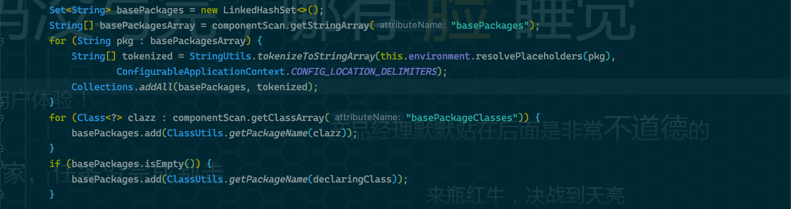

# @ComponentScan

## What

`@ComponentScan`注解实现`<context:component-scan>`的组件扫描指令。

## Features

* **扫描包的范围**：`basePackages`和`basePackageClasses`指定的包的合集，如果未指定，则为该注解声明类所在的包。
* **扫描的对象**：被`@Component`或其扩展注解标记的类，支持`JSR-250`的`@ManagedBean`和`JSR-330`的`@Named`。

## How

`@ComponentScan`由`ComponentScanAnnotationParser`类提供解析处理，方法为`parse()`。

```java
package org.springframework.context.annotation;

class ComponentScanAnnotationParser {

    public Set<BeanDefinitionHolder> parse(AnnotationAttributes componentScan, final String declaringClass) {
        ClassPathBeanDefinitionScanner scanner = new ClassPathBeanDefinitionScanner(this.registry,
                componentScan.getBoolean("useDefaultFilters"), this.environment, this.resourceLoader);

        Class<? extends BeanNameGenerator> generatorClass = componentScan.getClass("nameGenerator");
        boolean useInheritedGenerator = (BeanNameGenerator.class == generatorClass);
        scanner.setBeanNameGenerator(useInheritedGenerator ? this.beanNameGenerator :
                BeanUtils.instantiateClass(generatorClass));

        ScopedProxyMode scopedProxyMode = componentScan.getEnum("scopedProxy");
        if (scopedProxyMode != ScopedProxyMode.DEFAULT) {
            scanner.setScopedProxyMode(scopedProxyMode);
        } else {
            Class<? extends ScopeMetadataResolver> resolverClass = componentScan.getClass("scopeResolver");
            scanner.setScopeMetadataResolver(BeanUtils.instantiateClass(resolverClass));
        }

        scanner.setResourcePattern(componentScan.getString("resourcePattern"));

        for (AnnotationAttributes filter : componentScan.getAnnotationArray("includeFilters")) {
            for (TypeFilter typeFilter : typeFiltersFor(filter)) {
                scanner.addIncludeFilter(typeFilter);
            }
        }
        for (AnnotationAttributes filter : componentScan.getAnnotationArray("excludeFilters")) {
            for (TypeFilter typeFilter : typeFiltersFor(filter)) {
                scanner.addExcludeFilter(typeFilter);
            }
        }

        boolean lazyInit = componentScan.getBoolean("lazyInit");
        if (lazyInit) {
            scanner.getBeanDefinitionDefaults().setLazyInit(true);
        }

        // 解析要扫描的包，取 basePackages 和 basePackageClasses 指定的包的合集，如果未指定，则取 declaringClass 所在的包。
        Set<String> basePackages = new LinkedHashSet<>();
        String[] basePackagesArray = componentScan.getStringArray("basePackages");
        for (String pkg : basePackagesArray) {
            String[] tokenized = StringUtils.tokenizeToStringArray(this.environment.resolvePlaceholders(pkg),
                    ConfigurableApplicationContext.CONFIG_LOCATION_DELIMITERS);
            Collections.addAll(basePackages, tokenized);
        }
        for (Class<?> clazz : componentScan.getClassArray("basePackageClasses")) {
            basePackages.add(ClassUtils.getPackageName(clazz));
        }
        if (basePackages.isEmpty()) {
            basePackages.add(ClassUtils.getPackageName(declaringClass));
        }

        scanner.addExcludeFilter(new AbstractTypeHierarchyTraversingFilter(false, false) {

            @Override
            protected boolean matchClassName(String className) {
                return declaringClass.equals(className);
            }
        });
        return scanner.doScan(StringUtils.toStringArray(basePackages));
    }

}
```

### ClassPathBeanDefinitionScanner

第6-7行声明了一个`ClassPathBeanDefinitionScanner`实例，并将`@ComponentScan`的`useDefaultFilters`的值（默认为`true`）传入。

```java
ClassPathBeanDefinitionScanner scanner=new ClassPathBeanDefinitionScanner(this.registry,
        componentScan.getBoolean("useDefaultFilters"),this.environment,this.resourceLoader);
```

`ClassPathBeanDefinitionScanner`通过`registerDefaultFilters()`方法注册默认的`TypeFilter`。

* AnnotationTypeFilter(Component.class)
* AnnotationTypeFilter(ManagedBean.class)
* AnnotationTypeFilter(Named.class)

> `AnnotationTypeFilter(Component.class)`覆盖了`@Component`及其扩展，如`Repository`、`@Service`、`@Controller`等。

```java
public class ClassPathScanningCandidateComponentProvider implements EnvironmentCapable, ResourceLoaderAware {

    @SuppressWarnings("unchecked")
    protected void registerDefaultFilters() {
        this.includeFilters.add(new AnnotationTypeFilter(Component.class));
        ClassLoader cl = ClassPathScanningCandidateComponentProvider.class.getClassLoader();
        try {
            this.includeFilters.add(new AnnotationTypeFilter(
                    ((Class<? extends Annotation>) ClassUtils.forName("javax.annotation.ManagedBean", cl)), false));
            logger.trace("JSR-250 'javax.annotation.ManagedBean' found and supported for component scanning");
        } catch (ClassNotFoundException ex) {
            // JSR-250 1.1 API (as included in Java EE 6) not available - simply skip.
        }
        try {
            this.includeFilters.add(new AnnotationTypeFilter(
                    ((Class<? extends Annotation>) ClassUtils.forName("javax.inject.Named", cl)), false));
            logger.trace("JSR-330 'javax.inject.Named' annotation found and supported for component scanning");
        } catch (ClassNotFoundException ex) {
            // JSR-330 API not available - simply skip.
        }
    }

}
```

### 扫描包

41-53行解析扫描包的范围由属性`basePackages`和`basePackageClasses`指定的包的合集，如果未指定，则为该注解声明类所在的包。



### doScan


## Options

| option               | 类型      | 说明           | 默认         |
| -------------------- | --------- | -------------- | ------------ |
| `value`              | String[]  |                | {}           |
| `basePackages`       | String[]  |                | {}           |
| `basePackageClasses` | Class[]   |                | {}           |
| `nameGenerator`      |           |                |              |
| `scopeResolver`      |           |                |              |
| `scopedProxy`        |           |                |              |
| `resourcePattern`    | String    | 资源表达式     | `**/*.class` |
| `useDefaultFilters`  | boolean   | 使用默认过滤器 | `true`       |
| `includeFilters`     | `@Filter` | 包含过滤器     |              |
| `excludeFilters`     | `@Filter` | 排除过滤器     |              |
| `lazyInit`           | `boolean` | 懒加载         | `false`      |
|                      |           |                |              |
|                      |           |                |              |
|                      |           |                |              |

