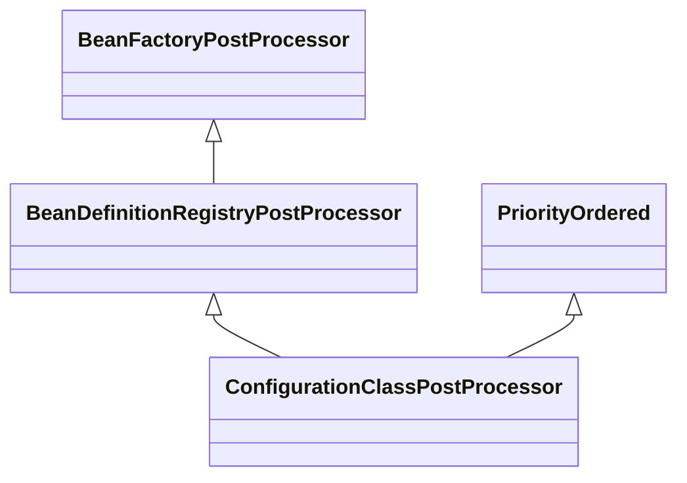
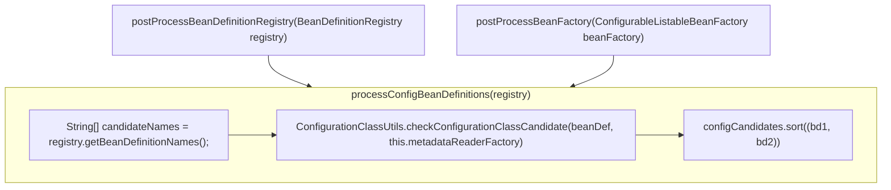

# ConfigurationClassPostProcessor

## What

`ConfigurationClassPostProcessor`是`BeanFactoryPostProcessor`的一个实现类，并且实现了`PriorityOrdered`接口，如下图所示：

## How

在`ConfigurableApplicationContext`的`refresh()`过程中，`postProcessBeanDefinitionRegistry()`和`postProcessBeanFactory()`方法被依次回调，触发`processConfigBeanDefinitions()`的执行，流程如下图所示：

在`processConfigBeanDefinitions()`方法中，主要有两个功能：

1. 从`BeanDefinitionRegistry`找到符合`ConfigurationClass`定义的`BeanDefinition`并排序;
2. 使用`ConfigurationClassParser`解析`ConfigurationClass`。
   