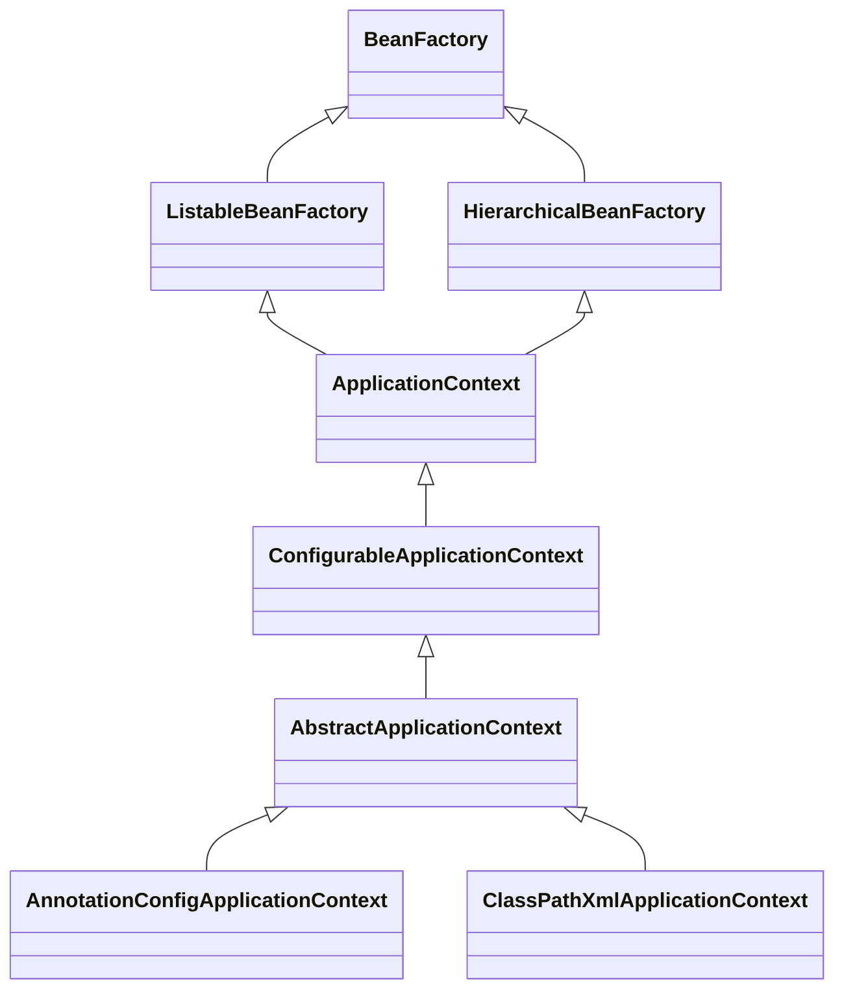
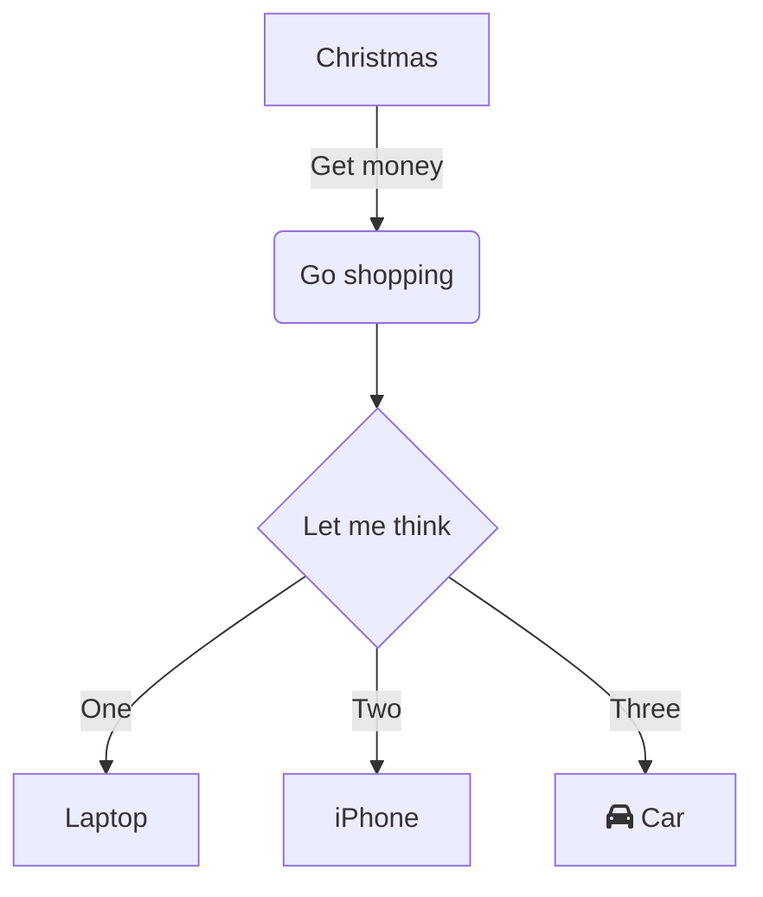
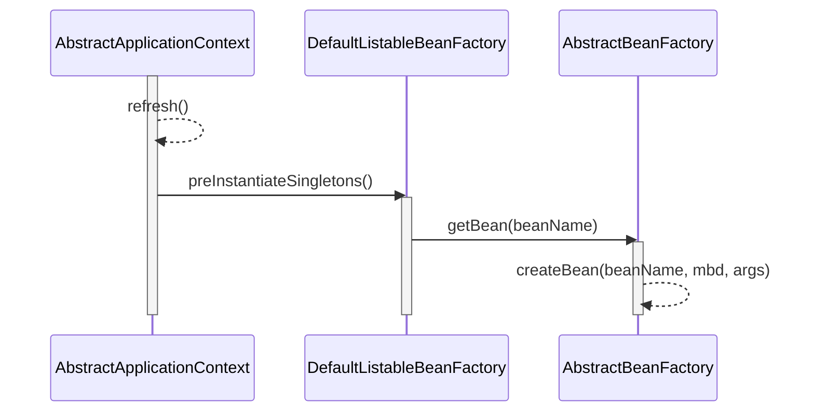

# ApplicationContext

## 简介

应用程序上下文（`ApplicationContext`）是 Spring Ioc 的基础。

## Class

```mermaid
classDiagram
    BeanFactory <|-- ListableBeanFactory
    BeanFactory <|-- HierarchicalBeanFactory
    ListableBeanFactory <|-- ApplicationContext
    HierarchicalBeanFactory <|-- ApplicationContext
    ApplicationContext <|-- ConfigurableApplicationContext
    ConfigurableApplicationContext <|-- AbstractApplicationContext
    AbstractApplicationContext <|-- AnnotationConfigApplicationContext
    AbstractApplicationContext <|-- ClassPathXmlApplicationContext
```

## Refresh

```mermaid
graph TD
	A[Christmas] -->|Get money| B(Go shopping)
	B --> C{Let me think}
	C -->|One| D[Laptop]
	C -->|Two| E[iPhone]
	C -->|Three| F[fa:fa-car Car]
```

```mermaid
sequenceDiagram
    participant AbstractApplicationContext
    participant DefaultListableBeanFactory
    participant AbstractBeanFactory
    
    activate AbstractApplicationContext
        AbstractApplicationContext-->>AbstractApplicationContext:refresh()
        AbstractApplicationContext->>DefaultListableBeanFactory:preInstantiateSingletons()
    
    activate DefaultListableBeanFactory
        DefaultListableBeanFactory->>AbstractBeanFactory:getBean(beanName)
    activate AbstractBeanFactory
    AbstractBeanFactory-->>AbstractBeanFactory:createBean(beanName, mbd, args)
    deactivate AbstractBeanFactory
    deactivate DefaultListableBeanFactory
    deactivate AbstractApplicationContext

```