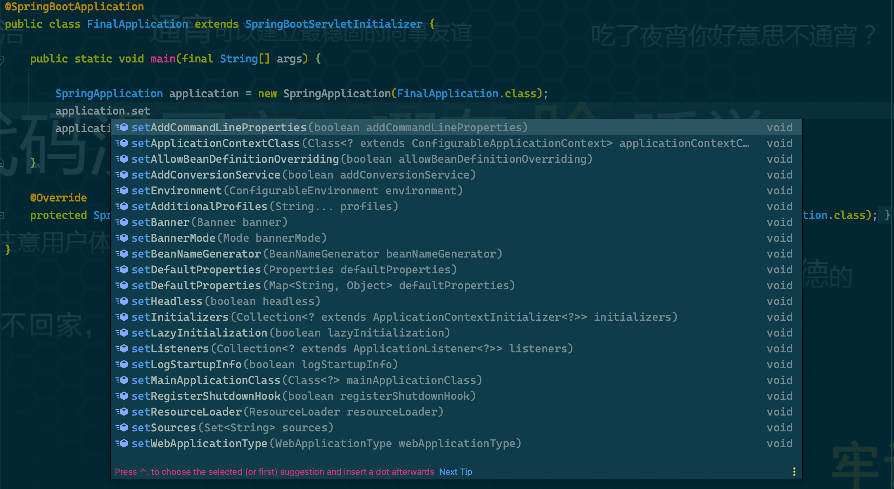

# Spring Application 启动流程

## 简介

**`SpringApplication`是 *Spring Boot* 提供的，可从 Java `main` 方法*引导和启动* `Spring` 应用程序的类。**

本文将以`SpringApplication`的使用方法`run(Class)`为切入点，通过分析构造方法和`run`方法的源码，了解`SpringApplication`应用的基本启动流程。

## 用法

### 常规用法

在大多数情况下，可以直接从`main`方法中调用静态`run(Class, String[])`方法来引导应用程序：

```java
package org.ifinal.finalframework.example;

@SpringBootApplication
public class FinalApplication {

    public static void main(final String[] args) {
        SpringApplication.run(FinalApplication.class);
    }

}
```

> 像在文章[你好，世界](hello-world.md)中的`SpringApplication.run(FinalApplication.class)`那样。

### 定制用法

对于更高级的配置，可以在运行之前创建和定制`SpringApplication`实例：

```java
public static void main(String[]args){
    SpringApplication application=new SpringApplication(MyApplication.class);
// ... customize application settings here
    application.run(args)
    }
```

通过IDE的代码提示功能，发现如下图的选项：




#### 注册监听

通过`addListeners`或`setListeners`方法，可以向应用中注册监听器(`ApplicationListener`)。

```java
application.addListeners(new ApplicationReadyEventListener());
```

## 默认实现

### 引导步骤

默认情况下，`SpringApplication`将执行以下步骤来引导您的应用程序：

* 创建一个适当的`ApplicationContext`实例（取决于您的类路径）。
* 注册一个`CommandLinePropertySource`以将命令行参数注入到为`Spring`属性中。
* 刷新应用程序上下文，加载所有单例 Bean。
* 触发任何`CommandLineRunner` Bean

### 加载Bean

加载并读取不同来源下的bean：

* 由 `AnnotatedBeanDefinitionReader` 加载的**应用完全限定的类名**所在包下的Bean。
* 由 `XmlBeanDefinitionReader`加载的声明在`XML`文件中的Bean。
* 由 `GroovyBeanDefinitionReader`加载的`groovy`脚本声明的Bean。
* 由 `ClassPathBeanDefinitionScanner` 扫描 `<context:component-scan>` 节点所指定的软件包中的Bean。

> 一般情况下，启动类所在的包应包含所有子模块的包，这样才能确保`SpringApplication`可以读取并加载到项目中声明的Bean。

## 启动流程

接下来，通过跟踪源码，看看 Spring 容器是如何启动的。就从`SpringApplication.run(Class)`开始吧：

* `SpringApplicatin.run(Class)`

```java
package org.springframework.boot;

public class SpringApplication {

    public static ConfigurableApplicationContext run(Class<?> primarySource, String... args) {
        return run(new Class<?>[]{primarySource}, args);
    }

    public static ConfigurableApplicationContext run(Class<?>[] primarySources, String[] args) {
        return new SpringApplication(primarySources).run(args);
    }

}
```

可以看到先是通过构造方法`new SpringApplication(primarySources)`创建了一个`SpringApplication`的实例，然后调用`run`方法。

* 先跟进构造方法：

```java
package org.springframework.boot;

public class SpringApplication {

    public SpringApplication(Class<?>... primarySources) {
        this(null, primarySources);
    }

    public SpringApplication(ResourceLoader resourceLoader, Class<?>... primarySources) {
        this.resourceLoader = resourceLoader;
        Assert.notNull(primarySources, "PrimarySources must not be null");
        // 保存配置源
        this.primarySources = new LinkedHashSet<>(Arrays.asList(primarySources));
        // 初始化 WEB 应用类型
        this.webApplicationType = WebApplicationType.deduceFromClasspath();
        // 加载 spring.factories 文件中的 ApplicationContextInitializer
        setInitializers((Collection) getSpringFactoriesInstances(ApplicationContextInitializer.class));
        // 加载 spring.factories 文件中的 ApplicationListener
        setListeners((Collection) getSpringFactoriesInstances(ApplicationListener.class));
        // 推断主应用类，这里是 FinalApplication，即参数类
        this.mainApplicationClass = deduceMainApplicationClass();
    }

}
```

在构造方法中，主要有以下几个步骤：

1. 保存传进来的启动类`primarySources`；
2. 初始化WEB应用类型；
3. 加载 `spring.factories` 文件中的 `ApplicationContextInitializer` 扩展；
4. 加载 `spring.factories` 文件中的 `ApplicationListener` 扩展；
5. 通过堆栈信息推倒主应用类，即`main`方法所在的类。

> `spring.factories` 会有专题来叙述，这里不再累赘，只需要知道是从 `META-INF/spring.factories` 配置文件中加载指定的SPI即可。

* 再来分析`run(String[])`方法

```java
package org.springframework.boot;

public class SpringApplication {

    public ConfigurableApplicationContext run(String... args) {
        // 开始停止监听
        StopWatch stopWatch = new StopWatch();
        stopWatch.start();

        ConfigurableApplicationContext context = null;
        // 异常报告收集 
        Collection<SpringBootExceptionReporter> exceptionReporters = new ArrayList<>();
        configureHeadlessProperty();

        // 开启事件监听
        SpringApplicationRunListeners listeners = getRunListeners(args);
        listeners.starting();
        try {
            // 解析启动参数
            ApplicationArguments applicationArguments = new DefaultApplicationArguments(args);
            // 准备 ConfigurableEnvironment
            ConfigurableEnvironment environment = prepareEnvironment(listeners, applicationArguments);
            configureIgnoreBeanInfo(environment);
            // 打印 Banner
            Banner printedBanner = printBanner(environment);
            // 创建 ApplicationContext
            context = createApplicationContext();
            exceptionReporters = getSpringFactoriesInstances(SpringBootExceptionReporter.class,
                new Class[]{ConfigurableApplicationContext.class}, context);
            // 准备 ApplicationContext
            prepareContext(context, environment, listeners, applicationArguments, printedBanner);
            // 刷新 ApplicationContext
            refreshContext(context);
            // 后置刷新回调，用于子类扩展
            afterRefresh(context, applicationArguments);
            stopWatch.stop();
            if (this.logStartupInfo) {
                new StartupInfoLogger(this.mainApplicationClass).logStarted(getApplicationLog(), stopWatch);
            }
            listeners.started(context);
            callRunners(context, applicationArguments);
        } catch (Throwable ex) {
            handleRunFailure(context, ex, exceptionReporters, listeners);
            throw new IllegalStateException(ex);
        }

        try {
            listeners.running(context);
        } catch (Throwable ex) {
            handleRunFailure(context, ex, exceptionReporters, null);
            throw new IllegalStateException(ex);
        }
        return context;
    }

}
```

在 `run` 方法中，主要有以下几个步骤：

1. 解析启动参数。
2. 准备环境（`ConfigurableEnvironment`）。
3. 通过`createApplicationContext()`方法创建应用上下文`ConfigurableApplicationContext`，这里会根据运行环境看初始为以下几种之一：
    * `AnnotationConfigServletWebServerApplicationContext`
    * `AnnotationConfigReactiveWebServerApplicationContext`
    * `AnnotationConfigApplicationContext`
4. 通过`prepareContext()` 方法准备上下文，主要是应用`ApplicationContextInitializer`的扩展点`initialize(context)`。
5. 通过`refreshContext(context)`刷新上下文（实例化所有单例），指向了`ConfigurableApplicationContext`接口的`refresh`方法。
6. 通过`afterRefresh(context, applicationArguments)` 方法后置刷新回调，用于子类扩展。

> `ConfigurableApplicationContext`的`refresh`方法是Spring应用上下文中的核心方法，会单独叙述。


至此，SpringApplication 的核心启动流程就完成了。

## 小结

本节以`SpringApplication.run(Class)`方法为着入点，通过分析构造方法和`run`方法，获取了以下知识点：

* 在构造方法中会加载在`spring.factories`文件中声明的扩展点`ApplicationContextInitializer`和`ApplicationListener`;
* 通过运行环境实例化不同的应用上下文；
* 在`prepareContext`准备环节中应用了的扩展点`ApplicationContextInitializer`的`initialize(context)`方法。
* 在`refreshContext(context)`刷新环节中，指向了`ConfigurableApplicationContext`接口的`refresh`方法。

本文结束。